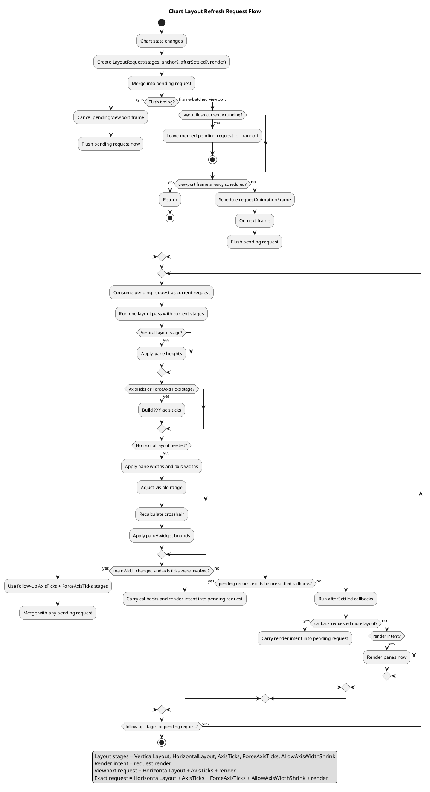

## Context

Before this change, `ChartImp.adjustPaneViewport(...)` was the central refresh primitive for pane layout, axis tick building, axis width measurement, visible range adjustment, crosshair recalculation, and pane repaint. The implementation was centralized, but its low-level boolean controls were called directly from several layers:

- `Chart` public API methods and pane management paths.
- `ChartStore` data mutation paths.
- `TimeScaleStore` scroll, zoom, and range refresh paths.
- `Event` axis interaction paths.
- `SeparatorWidget` pane resize dragging.

The underlying dependency cycle is expected for a financial chart:

```text
container / pane / style state
  -> pane height and width
  -> mainWidth
  -> visible range
  -> visible data and Y-axis range
  -> axis ticks and label widths
  -> mainWidth
```

The problem is not that this pipeline exists. The problem is that callers outside `Chart` must know which booleans trigger which portions of the pipeline, and that layout work and pane repaint were not described as separate concepts.

## Goals / Non-Goals

**Goals:**

- Make layout refresh call sites semantic and readable.
- Keep `Chart` as the owner of low-level layout stages, convergence, and render timing.
- Preserve current synchronous behavior for data callbacks, resize, and indicator calculation completion.
- Coalesce high-frequency viewport-only interaction refreshes into one frame-batched layout request flush.
- Separate layout stages from render intent so panes repaint only after layout settles.

**Non-Goals:**

- Do not change public chart APIs.
- Do not rewrite axis tick calculation, pane height allocation, or time scale modes.
- Do not make data callbacks, resize, pane layout, metric layout, or exact layout paths asynchronous.
- Do not introduce a broader rendering scheduler for all pane updates in this change.

## Decisions

### Add semantic refresh methods on `Chart`

`ChartImp` exposes internal semantic methods used by chart-owned stores, events, and widgets:

- `refreshPaneLayout()`
- `refreshViewportLayout(afterLayoutSettled?)`
- `requestViewportLayout()`
- `refreshMetricLayout()`
- `refreshResizeLayout(anchor?)`

The semantic methods submit layout requests rather than low-level boolean combinations. Data changes, time-scale changes, and axis interactions use viewport layout stages because they need the same visible range, tick, horizontal layout, and render sequence. Style, option, locale, and metric-affecting changes use exact layout stages because they can legitimately force tick rebuilding and shrink auto axis width.

Alternative considered: replace `adjustPaneViewport(...)` with an options object immediately. This improves readability at each call site, but still leaks low-level layout mechanics to stores and widgets.

### Use a coalescing layout request scheduler as the pipeline primitive

The shared pipeline is modeled as a coalescing layout request:

- `stages`: low-level layout work such as `VerticalLayout`, `HorizontalLayout`, `AxisTicks`, `ForceAxisTicks`, and `AllowAxisWidthShrink`.
- `resizeAnchor`: optional resize anchoring metadata.
- `afterLayoutSettled`: optional callback to run after layout passes settle.
- `render`: whether panes should repaint after the request settles.

Synchronous semantic methods cancel any pending viewport frame, merge their request into pending scheduler state, and flush immediately. If another request is submitted while a flush is already running, it is merged into the pending request and handled after the current pass reaches a safe handoff point. The legacy `adjustPaneViewport(...)` boolean adapter is removed.

Alternative considered: use FIFO layout jobs. That makes each re-entrant request explicit, but chart layout is mostly derived from current state, so repeated jobs can cause redundant intermediate layout and render work. A single pending request better matches the "latest stable state wins" model.

### Add frame-batched viewport requests for high-frequency interactions

`requestViewportLayout()` merges a viewport request into pending scheduler state and schedules a flush on the next animation frame. Repeated viewport requests before that frame reuse the scheduled frame instead of running repeated layout work. If viewport requests happen while another layout flush is already running, they merge into the pending request for the next safe handoff point.

Synchronous entry points remain authoritative. If a synchronous pane, metric, resize, or direct viewport refresh arrives while a viewport frame is scheduled, the frame is canceled and the merged pending request flushes immediately. This keeps data callbacks and exact layout operations synchronous while gaining Lightweight Charts-style batching for bursty viewport interactions.

### Keep layout and render separate

Layout stages only compute geometry, ticks, visible range, crosshair state, and pane bounds. Pane repaint is represented by the request's `render` intent and runs only after layout has settled. Pure pane repaint paths can render directly without submitting a layout request.

This separation keeps the timing contract clear:

- Synchronous data, pane, metric, and resize paths complete layout before returning.
- Frame-batched viewport requests defer both viewport layout and its resulting repaint to the scheduled frame.
- Pane repaint is skipped for an intermediate pass when a follow-up layout pass or layout-settled callback submits more layout work.

### Keep the public chart type narrow

The root `init()` API should return the exported `Chart` interface rather than the concrete `ChartImp` class type. This keeps internal refresh methods available to chart-owned internals without advertising them as part of the public chart contract.

Alternative considered: expose refresh methods on the public `Chart` type and mark them internal by convention. That is easy, but it still leaks implementation details to consumers and external mocks.

### Use request-driven layout convergence

The existing resize path ran multiple passes until `mainWidth` stabilized because width changes can shift visible range, which can then affect Y-axis range, axis ticks, and axis label width. This logic belongs in the shared layout request flush rather than a single resize caller.

Each request pass runs the requested layout stages. If horizontal layout changes `mainWidth` after axis ticks were involved, the pass returns follow-up axis stages. The scheduler loop then runs another pass before repainting. If re-entrant work is requested before render, the current request's callbacks and render intent are carried into the merged pending request. A high safety cap prevents accidental infinite layout loops, but normal convergence is driven by passes returning no follow-up stages and pending requests becoming empty.

Alternative considered: leave stabilization only in resize. That keeps the smaller code change, but it leaves the main layout cycle unresolved for non-resize paths that also change visible range and axis label width.

### Run initial auto alignment after layout settles

Initial data alignment depends on the final `mainWidth`, which can change after data-driven axis ticks are built and Y-axis label widths are measured. Init data loading therefore calls `refreshViewportLayout(...)` with `autoInitialAlignment()` as its layout-settled callback.

Layout-settled callbacks run after layout passes have no follow-up stages but before the request renders. If a callback changes time-scale state and submits another viewport request, the current render is skipped and the merged pending request flushes next. This lets initial auto alignment use stable width while avoiding an intermediate repaint based on the pre-alignment visible range.

### Keep viewport refreshes grow-only for auto axis width

Viewport refreshes avoid full layout contraction when axis labels become shorter. When `yAxis.size` is `auto`, viewport requests measure the new label width but keep the previous axis width if the new optimal width is smaller. If labels require more space, the axis can widen and return a follow-up axis pass when the resulting `mainWidth` changes.

Full metric/layout paths (`refreshPaneLayout()`, `refreshMetricLayout()`, and `refreshResizeLayout(anchor?)`) include `AllowAxisWidthShrink`, so they recompute exact axis width and may shrink it. This avoids turning ordinary scroll/data updates into full layout churn while still allowing style, pane, and resize changes to settle to the exact layout.

## Layout Refresh Flow



## Risks / Trade-offs

- [Risk] A semantic method may map to the wrong layout stages and subtly miss a refresh step. -> Mitigation: add focused tests against request creation, request merging, and layout pass behavior.
- [Risk] Some tests mock only the old boolean refresh adapter; replacing call sites can break mocks without behavior changes. -> Mitigation: update mocks to use semantic methods or request-level helpers where needed.
- [Risk] Narrowing the `init()` return type may expose consumer code that relied on implementation-class-only methods. -> Mitigation: this aligns the generated type with the documented public `Chart` contract and keeps internal refresh hooks out of that contract.
- [Risk] Applying convergence to more refresh paths can add extra axis tick/width work when axis labels change. -> Mitigation: drive follow-up work only from concrete layout stage results and keep a safety cap for unexpected non-settling request flushes.
- [Risk] Confusing layout and render timing can lead to subtle callback assumptions. -> Mitigation: keep render intent separate from layout stages and preserve synchronous behavior for public data, pane, metric, and resize paths.

## Migration Plan

1. Add semantic refresh methods to `ChartImp`.
2. Add internal layout stage flags and a shared coalescing layout request scheduler.
3. Separate layout stages from request render intent.
4. Remove `adjustPaneViewport(...)` and route all remaining internal cases through semantic methods or private intent helpers.
5. Return the exported `Chart` interface from `init()` while keeping `ChartImp` as the internal concrete class.
6. Move main-width convergence from `resize()` into layout request follow-up passes.
7. Replace non-`Chart` call sites in stores, events, and widgets with semantic methods.
8. Update focused tests and mocks.
9. Run targeted tests, then type-check.

Rollback is straightforward: restore the replaced call sites to their previous boolean refresh invocations and remove the semantic methods and request scheduler.
