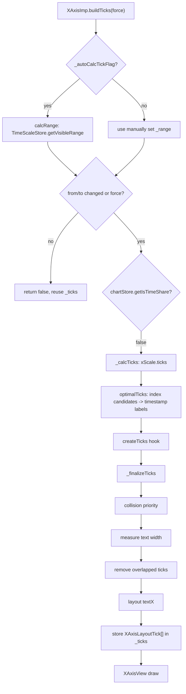
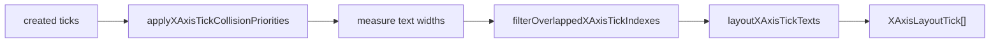
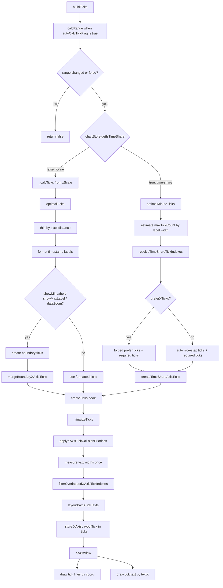
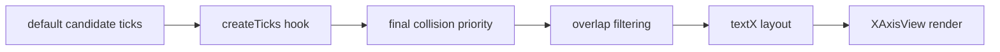

dm-refactor

this is the branch used for dm Super Boss.

## K 线模式下 X 轴 tick 生成逻辑

这里的“K 线模式”特指 `XAxisImp.buildTicks()` 里 `chartStore.getIsTimeShare() === false` 的分支。它包括普通 `KLineTimeScaleMode`，也包括开启 `dataZoom` 后的 `DataZoomTimeScaleMode`；因为 X 轴 tick 的分支选择只看 `isTimeShare`，不看当前 time scale mode kind。

### 一句话结论

X 轴 tick 不是直接按数据列表逐根生成的。它先从当前可见区间的线性 `xScale` 生成一组“数据索引候选值”，再按屏幕宽度做抽稀，把索引映射到 K 线数据的 `timestamp`，根据相邻时间判断显示 `HH:mm` / `MM-DD` / `YYYY-MM` / `YYYY`，按需要补左右边界 tick，最后统一做自定义 hook、碰撞裁剪和文字位置修正。

### 主流程



`buildTicks()` 只有在 `range.from` / `range.to` 变化或 `force === true` 时才会重建 tick。`domainFrom` / `domainTo` 的小数变化本身不会触发重建，所以只发生亚像素级滚动或缩放、但可见整数索引边界不变时，需要外部用 `force` 驱动刷新。

### 可见区间和坐标来源

K 线 tick 的坐标来自 `TimeScaleStore.getXScale()`。`TimeScaleStore.adjustVisibleRange()` 每次刷新可见区间后都会重建 `_xScale`：

```ts
createLinear({
  domain: [domainFrom - 0.5, domainTo - 0.5],
  range: [0, mainWidth]
})
```

这里减 `0.5` 的作用是让整数 data index 对齐到蜡烛柱中心。可以把 X 轴想成一排格子：第 0 根 K 线的中心在 index `0`，但它占据的格子从 `-0.5` 到 `0.5`；所以线性域用 `domainFrom - 0.5` 到 `domainTo - 0.5`，`convertToPixel(index)` 得到的是该根 K 线的中心点。

普通 K 线模式下，`KLineTimeScaleMode` 用 `barWidth + offsetRight` 推导可见区间：

- `from`: 当前可见的第一个整数 data index。
- `to`: 当前可见区间右侧的整数边界，语义上接近 exclusive end。
- `domainFrom` / `domainTo`: 图表左右边缘对应的小数 data index，用于线性缩放。
- `offsetRight`: 右侧留白，滚动和追加数据会直接改变它。
- `barWidth`: 单根 K 线占用的横向宽度，缩放会直接改变它。

DataZoom 模式下仍走 K 线 tick 分支，但 `DataZoomTimeScaleMode` 用 `start/end` 百分比推导 `domainFrom/domainTo`，再反推 `barWidth/offsetRight`。这会影响候选 tick 的坐标和可见边界。

### `_calcTicks()`: 先生成“索引候选值”

`_calcTicks()` 只做候选值，不做最终文案：

1. 从 `xScale.ticks()` 取一组线性刻度。默认 tick 数是 `10`。
2. `xScale.ticks()` 使用 `1/2/5 * 10^n` 风格的 nice step，所以候选值可能是 `0, 10, 20`，也可能在极端缩放时出现小数。
3. 如果第一个候选值小于 `range.from`，代码会丢掉原始 nice 起点，改从 `range.from` 开始按同样 step 往右补候选值，直到不超过原始最后一个 tick 且不超过 `range.to`。
4. 返回形如 `{ text: String(value), coord: 0, value }` 的临时 `AxisTick[]`。

这一步的 `coord` 固定为 `0`，因为候选 tick 还没有确认是否能映射到真实 K 线数据。真正的坐标在 `optimalTicks()` 里通过 `convertToPixel(pos)` 计算。

需要注意：后续会用 `parseInt(tick.value as string, 10)` 把候选值当成 data index。运行时即使 `value` 是 number，也会被 `parseInt` 转成整数。因此小数候选值会向整数部分截断；如果相邻候选截断到同一个 index，后续抽稀会把它们当成距离很近甚至同一点的 tick。

### `optimalTicks()`: 抽稀、取数据、格式化文本

`optimalTicks()` 是 K 线 tick 的核心逻辑。它接收 `_calcTicks()` 的索引候选值，然后输出带真实坐标和真实 timestamp 的 tick。

#### 1. 用默认标签宽度估算抽稀间隔

代码先测量字符串 `00-00 00:00` 在当前 X 轴字体下的宽度，作为 K 线标签的保守宽度估计：

```ts
const defaultLabelWidth = calcTextWidth(
  '00-00 00:00',
  createFont(size, weight, fontFamily)
)
```

然后只看前两个候选 tick 的屏幕距离：

```ts
const xDif = Math.abs(nextX - x)
if (xDif < defaultLabelWidth * 1.5) {
  tickCountDif = Math.ceil(defaultLabelWidth * 1.5 / xDif)
}
```

`tickCountDif` 就是抽稀步长。线性 X 轴上候选间距是均匀的，所以只看第一段距离足够代表整段候选序列。阈值用 `1.5 * defaultLabelWidth`，意思是两个候选标签中心之间至少要留出大约一个半标签宽，否则就跳过一些候选。

#### 2. 候选 index 必须映射到真实数据

抽稀后的循环是：

```ts
for (let i = 0; i < tickLength; i += tickCountDif) {
  const pos = parseInt(ticks[i].value as string, 10)
  const kLineData = dataList[pos]
  if (!isValid(kLineData)) continue
  ...
}
```

所以 tick 能留下来的第一条件是 `dataList[pos]` 存在。超出数据范围、落在空数据上的候选都会被跳过。这也是为什么 `_calcTicks()` 只负责数学候选，`optimalTicks()` 才负责数据有效性。

#### 3. 默认显示 `HH:mm`

每个有效候选先用该根 K 线的 `timestamp` 格式化成 `HH:mm`：

```ts
let text = formatDate(dateTimeFormat, timestamp, 'HH:mm', FormatDateType.XAxis)
```

输出 tick 的 `value` 会从候选 index 变成真实 `timestamp`：

```ts
optimalTicks.push({ text, coord: x, value: timestamp })
```

这个转换很关键：后续补边界 tick、合并去重、边界优先级判断，都是按 timestamp 作为 tick 的值。

#### 4. 跨日、跨月、跨年时升级标签粒度

除了第一枚 tick，其他 tick 会拿当前 timestamp 和前一个“被抽稀步长命中的候选”的 timestamp 比较：

```ts
this._optimalTickLabel(formatDate, dateTimeFormat, timestamp, prevTimestamp)
```

`_optimalTickLabel()` 的规则是从大到小判断：

- 如果年份不同，返回 `YYYY`。
- 否则如果月份不同，返回 `YYYY-MM`。
- 否则如果日期不同，返回 `MM-DD`。
- 否则返回 `null`，保持默认 `HH:mm`。

这就是 K 线 X 轴上日期分隔标签的来源。它不是单独扫描全量数据找自然日边界，而是在已经抽稀的候选 tick 上，根据当前 tick 与上一个抽稀候选 tick 的时间差来判断是否需要显示更高层级的日期。

#### 5. 第一枚 tick 会被二次修正

第一枚 tick 一开始没有前序 tick 可比较，所以先默认是 `HH:mm`。循环结束后，代码会单独修正第一枚 tick：

- 如果最终只有 1 个 tick，第一枚显示 `YYYY-MM-DD HH:mm`，避免单独一个 `09:30` 信息太少。
- 如果至少 3 个 tick，会检查第 3 个 tick 的文本格式：
  - 第 3 个是 `MM-DD`，第一枚也改成 `MM-DD`。
  - 第 3 个是 `YYYY-MM`，第一枚也改成 `YYYY-MM`。
  - 第 3 个是 `YYYY`，第一枚也改成 `YYYY`。
- 如果只有 2 个 tick，会拿第一枚和第二枚做 `_optimalTickLabel()`，能判断出跨日/月/年时才改第一枚，否则保持 `HH:mm`。

这段逻辑的意图是让左侧第一枚标签的粒度和后面的日期边界标签保持一致。比如后面已经开始显示 `05-12` 这种日级标签，第一枚继续显示 `09:30` 会让用户难以知道左边起点属于哪一天。

### 左右边界 tick

`optimalTicks()` 生成常规 tick 后，会根据布局选项决定是否额外补可见区间左右边界。

布局选项来自：

```ts
resolveXAxisTickLayoutOptions(chart.getStyles().xAxis, chartStore.getDataZoomEnabled())
```

规则是：

- 普通 K 线模式下，使用样式里的 `xAxis.showMinLabel` 和 `xAxis.showMaxLabel`。默认样式两者都是 `true`。
- DataZoom 开启时，`showMinLabel` 和 `showMaxLabel` 都被强制视为 `true`，即使样式里关掉了也会补边界标签。

补边界由 `_createBoundaryTicks()` 完成：

1. 左边界 index 是 `Math.max(Math.floor(range.from), 0)`。
2. 右边界 index 是 `Math.min(Math.ceil(range.to) - 1, dataList.length - 1)`。
3. 如果需要最小标签，加入左边界 index。
4. 如果需要最大标签且左右不是同一根，加入右边界 index。
5. 每个边界 tick 的 `coord` 用 `convertToPixel(index)`，`value` 用该根数据的 `timestamp`。

边界 tick 的文本默认也是 `HH:mm`。如果它前一根真实数据存在，则和前一根真实数据比较，跨年显示 `YYYY`，跨月显示 `YYYY-MM`，跨日显示 `MM-DD`，否则保持 `HH:mm`。

最后 `mergeBoundaryXAxisTicks()` 把常规 tick 和边界 tick 合并：

- 用 `tick.value` 去重，也就是用 timestamp 去重。
- 如果常规 tick 已经有同 timestamp，边界 tick 不会覆盖它。
- 合并后按 `coord` 从左到右排序。

这意味着边界 tick 的主要职责是“补缺”。如果常规 tick 已经命中了边界 timestamp，最终保留的是常规 tick 原来的文本。

### `createTicks` hook 的位置

默认 X 轴模板是：

```ts
createTicks: ({ defaultTicks }) => defaultTicks
```

也就是说，普通情况下 `optimalTicks()` 的输出会原样进入最终布局。但如果注册了自定义 X 轴，`createTicks({ range, bounding, defaultTicks })` 可以替换、增加或删除 tick。

重要边界是：`createTicks` 发生在 K 线默认 tick 生成之后、最终碰撞裁剪之前。所以自定义 hook 返回的 tick 仍然会经过：

- 边界优先级标记。
- 文本宽度测量。
- 重叠删除。
- `textX` 边缘修正。

因此 hook 不需要自己计算 `textX`，但它必须提供合理的 `text`、`coord`、`value`。如果 hook 返回顺序不是从左到右，后面的“首尾标签优先级”和“相邻碰撞检测”都会按 hook 的数组顺序理解，而不是重新按坐标排序。

### 最终碰撞处理

`_finalizeTicks()` 对 K 线分支做最后一道统一处理：



#### 1. 首尾优先级

如果 `showMinLabel` 或 `showMaxLabel` 生效，`applyXAxisTickCollisionPriorities()` 会给数组里的第一枚和最后一枚 tick 加碰撞优先级：

- 最后一枚 tick: priority `3`。
- 第一枚 tick: priority `2`。
- 普通 tick: 默认 priority `0`。

如果首尾互相重叠，右侧最大标签优先级更高，所以会保留右侧。

这里的“第一枚/最后一枚”是传入数组的首尾。默认路径下，`mergeBoundaryXAxisTicks()` 已经按坐标排序，所以首尾就是最左/最右；自定义 hook 需要自己维护这个顺序。

#### 2. 宽度只测一次

`_filterOverlappedTicks()` 会用当前 X 轴字体把每个 tick 的 `text` 宽度算出来：

```ts
const widths = ticks.map(tick => calcTextWidth(tick.text, font))
```

之后碰撞检测和最终布局复用这组宽度。绘制阶段不再重新决定 tick 数量。

#### 3. 贪心删除重叠 tick

`filterOverlappedXAxisTickIndexes()` 维护一个 `selectedIndexes`，初始包含所有 tick，然后从左到右比较相邻的已选 tick。

判断两个标签是否重叠的公式是：

```ts
distance < (leftWidth + rightWidth) / 2 + X_AXIS_TICK_MIN_GAP
```

其中 `X_AXIS_TICK_MIN_GAP = 6`。也就是说，两个文字盒子之间至少要留 6px 空隙。

发生重叠时：

- 左侧优先级低于右侧，删左侧。
- 左侧优先级高于右侧，删右侧。
- 优先级相同，删右侧。

删除后指针会回退一格，重新检查新的相邻关系。这是一个局部贪心算法：它不做全局最优排列，而是保证最终相邻标签不重叠，并尽量保住高优先级的边界标签。

#### 4. 首尾文字会被压回画布内

碰撞检测和最终布局都会调用 `createXAxisTickTextLayout()`。它只修正当前已选 tick 中的第一枚和最后一枚：

- 第一枚如果文字左边越过 `x = 0`，把文字中心右移到刚好不越界。
- 最后一枚如果文字右边越过 `canvasWidth`，把文字中心左移到刚好不越界。
- 中间 tick 不做位置修正。

最终保存的是 `XAxisLayoutTick`，比普通 `AxisTick` 多一个 `textX`。`coord` 仍然代表 tick 线和数据点中心，`textX` 只代表文字绘制中心。

### 绘制阶段

`XAxisView` 不再参与 tick 选择，只消费 `axis.getTicks()`：

- tick line 使用 `tick.coord`，从轴线向下画。
- tick text 使用 `tick.textX`，水平居中，垂直位置是 `axisLine.size + tickLine.length + tickText.marginStart`。

所以一枚 tick 最终有两个不同的 X 坐标语义：

- `coord`: 数据位置，线的位置，不能为了防止文字越界而移动。
- `textX`: 文字中心，允许首尾为了留在画布内做轻微移动。

### 关键行为示例

1. 可见区间很宽、候选距离足够大时，`tickCountDif = 1`，所有 `xScale.ticks()` 候选只要能映射到数据都会进入格式化。
2. 缩放到标签太密时，`tickCountDif` 会变大，比如每 3 个候选取 1 个。
3. 候选落在同一天内，标签通常是 `HH:mm`。
4. 候选跨天时，新一天的 tick 会显示 `MM-DD`。
5. 候选跨月时，新月份的 tick 会显示 `YYYY-MM`。
6. 候选跨年时，新年份的 tick 会显示 `YYYY`。
7. `showMinLabel/showMaxLabel` 打开时，会额外补当前可见数据的首尾 timestamp。
8. DataZoom 打开时，即使样式关闭首尾标签，也会强制补首尾。
9. 首尾和普通 tick 重叠时，碰撞优先级会优先保留首尾；首尾互相重叠时优先保留右侧最大标签。

### 代码层面的注意点

- `buildTicks()` 的刷新判断只看 `from/to`，不看 `domainFrom/domainTo`。如果仅小数域变化，默认不会重建 tick。
- `_calcTicks()` 生成的是数学候选，`optimalTicks()` 才检查 `dataList[pos]` 是否存在。
- 候选值通过 `parseInt` 转成 data index；小数候选会截断。
- 常规 tick 的 `value` 最终是 timestamp，不是 data index。
- 边界 tick 用 timestamp 去重，所以同一根数据不会出现两枚 tick。
- 边界 tick 只补缺，不覆盖已有常规 tick 的文本。
- 最终碰撞处理发生在 `createTicks` hook 之后，自定义 tick 也会被过滤和布局。
- 默认路径下 tick 会按 `coord` 排序；自定义 hook 如果返回乱序数组，碰撞优先级和相邻检测都会受影响。
- `XAxisView` 只负责绘制，不负责生成或过滤 tick。

## XAxis tick flow



## Boundary notes



The important boundary is that final overlap filtering and `textX` layout happen after `createTicks`.
This keeps custom hook output from bypassing collision handling or producing ticks without `textX`.

Remaining rough edges:

- K-line `optimalTicks` still mixes candidate selection and label formatting.
- Time-share `maxTickCount` is estimated with `00:00`, while multi-day labels can be wider.
- `XAxis.ts` still contains selector, formatter, and layout helpers in one file.


有，K 线模式下 tick 生成能工作，但有几处抽象和边界行为不太合理。按优先级看：

**高优先级问题**

1. `buildTicks()` 只用 `from/to` 判断是否重建，忽略 `domainFrom/domainTo`

   位置：[XAxis.ts](/Users/wxli/workspace/dm/KLineChart/src/component/XAxis.ts:433)

   ```ts
   if (this._prevRange.from !== this._range.from || this._prevRange.to !== this._range.to || force)
   ```

   但 X 坐标真正来自 `domainFrom/domainTo` 构造的 `xScale`：[TimeScaleStore.ts](/Users/wxli/workspace/dm/KLineChart/src/store/TimeScaleStore.ts:403)

   结果是：小幅滚动、拖动 DataZoom、缩放时，只要整数可见边界 `from/to` 没变，旧 tick 的 `coord/textX` 可能继续被复用。蜡烛图已经按新 `xScale` 画了，但 X 轴 tick 还在旧位置。

   费曼式说法：`from/to` 是“看见了哪几根 K 线”，`domainFrom/domainTo` 是“这些 K 线现在在屏幕哪里”。现在只检查“看见哪几根”，没检查“位置有没有移动”。

   建议：至少把 `domainFrom/domainTo` 纳入变更判断；更好的做法是把“选哪些 tick”和“tick 坐标布局”拆开，语义 tick 可缓存，坐标每次随 `xScale` 更新。

2. `_calcTicks()` 把 nice tick 强行改成 `from`，可能绕过 `showMinLabel`

   位置：[XAxis.ts](/Users/wxli/workspace/dm/KLineChart/src/component/XAxis.ts:468)

   当 `xScale.ticks()` 第一个 tick 小于 `range.from` 时，代码从 `from` 开始补 tick：

   ```ts
   let it = from
   ```

   这会让左边界成为普通 tick。即使用户设置 `showMinLabel: false`，也可能出现左边界标签。语义上 `showMinLabel` 应该控制“是否显示最小边界标签”，但这里的普通候选 tick 可能提前把边界显示出来。

   建议：候选 tick 应该从第一个 `>= from` 的 nice tick 开始，而不是直接从 `from` 开始；只有 `showMinLabel` 生效时才补 `from`。

3. `parseInt()` 处理连续刻度不稳

   位置：[XAxis.ts](/Users/wxli/workspace/dm/KLineChart/src/component/XAxis.ts:504)

   `xScale.ticks()` 生成的是连续数值，后面用：

   ```ts
   parseInt(ticks[i].value as string, 10)
   ```

   小数 tick 会被截断。高倍缩放时，前两个 tick 可能都截断到同一个 data index，导致：

   ```ts
   xDif = 0
   tickCountDif = Infinity
   ```

   这不会死循环，但会让后续 tick 基本被跳过，行为很脆。

   建议：K 线 X 轴本质是离散 data index，不应该先生成连续 tick 再 `parseInt`。可以直接在整数 data index 空间生成候选，并做去重。

**中优先级问题**

4. tick 数量先固定约 10 个，再抽稀，不能根据宽度“增密”

   位置：[XAxis.ts](/Users/wxli/workspace/dm/KLineChart/src/component/XAxis.ts:462)

   `xScale.ticks()` 默认 tick count 是 10。后面只会因为文字太密而减少，不会因为屏幕很宽而增加。所以宽屏下 X 轴可能偏稀疏。

   Time-share 分支反而会按宽度估算 `maxTickCount`：[XAxis.ts](/Users/wxli/workspace/dm/KLineChart/src/component/XAxis.ts:575)

   建议：K 线也按 `axisWidth / labelMinGap` 推导目标 tick count，再传给 `xScale.ticks(count)` 或离散 index tick 生成器。

5. 第一枚 tick 的格式通过“第三枚 tick 的文本 regex”推断，抽象不稳

   位置：[XAxis.ts](/Users/wxli/workspace/dm/KLineChart/src/component/XAxis.ts:538)

   代码用第三枚 tick 的 `text` 判断第一枚要不要改成 `MM-DD` / `YYYY-MM` / `YYYY`。这依赖最终文本格式：

   ```ts
   /^[0-9]{2}-[0-9]{2}$/
   ```

   如果用户自定义 `formatDate` 输出不是这个格式，逻辑就失效。更根本的问题是：用“显示文本”反推“时间粒度”不可靠。

   建议：用 timestamp 的年月日变化计算语义粒度，再用 formatter 生成文本。

6. 边界 tick 只“补缺”，不覆盖常规 tick，可能保留较差文案

   位置：[XAxis.ts](/Users/wxli/workspace/dm/KLineChart/src/component/XAxis.ts:44)

   `mergeBoundaryXAxisTicks()` 如果同 timestamp 已存在，就保留常规 tick：

   ```ts
   if (!ticksByValue.has(tick.value)) {
   ```

   但边界 tick 的格式可能更适合边界场景，比如左边界刚好是新一天第一根，边界 tick 会参考前一根数据生成日期标签，常规 tick 未必会。

   建议：边界 tick 可以覆盖常规 tick 的 `text`，或者至少边界 tick 保留更高优先级/格式策略。

**低优先级但值得注意**

7. 单个超长标签可能仍然越界

   位置：[XAxis.ts](/Users/wxli/workspace/dm/KLineChart/src/component/XAxis.ts:163)

   `createXAxisTickTextLayout()` 用 `if / else if`，单 tick 时只走“第一枚”逻辑，不会再检查右边界。窄画布 + `YYYY-MM-DD HH:mm` 时可能右侧溢出。

8. 碰撞过滤是局部贪心

   位置：[XAxis.ts](/Users/wxli/workspace/dm/KLineChart/src/component/XAxis.ts:113)

   默认 tick 少时没问题。但如果自定义 `createTicks` 返回很多 tick，`splice` + 回退的方式最坏会偏 O(n²)，且结果不是全局最优。

**总体判断**

最大的不合理不是“格式化细节”，而是抽象层级混在一起了：连续 `xScale.ticks()`、离散 K 线 data index、timestamp 语义、边界标签、碰撞布局都揉在 `optimalTicks()` 里。

更合理的结构应该是：

1. 在离散 data index 空间生成候选。
2. 根据宽度决定候选密度。
3. 用 timestamp 计算语义粒度。
4. 明确合并边界 tick。
5. 最后只做碰撞和 `textX` 布局。

优先修的话，我会先处理 `domainFrom/domainTo` 缓存判断和 `parseInt` 连续刻度转离散索引这两个点。
