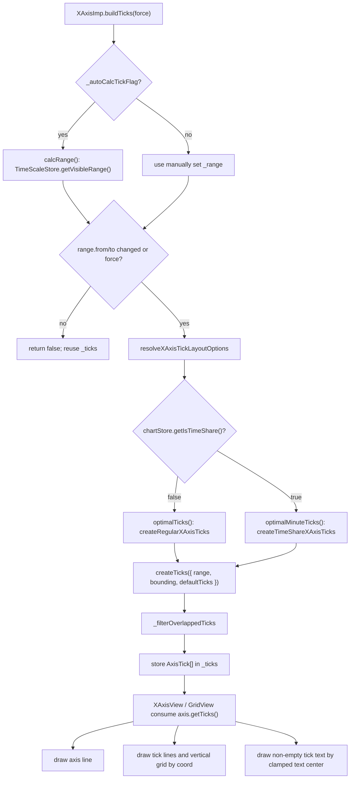
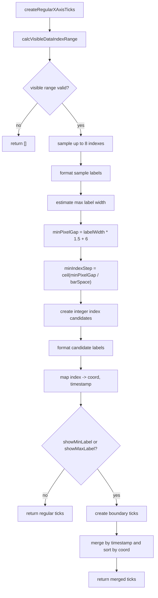
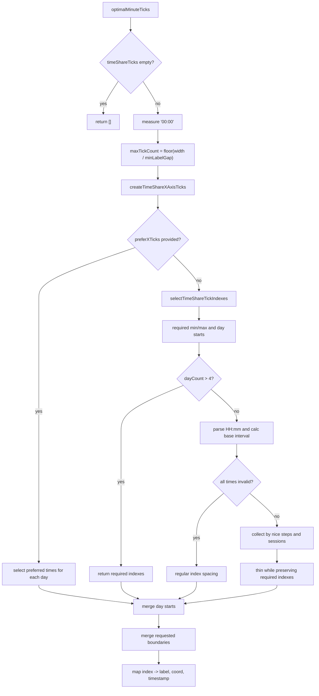
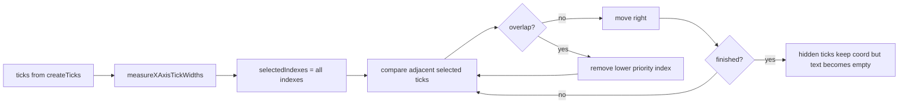
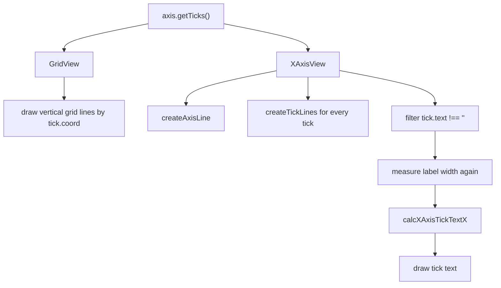

dm-refactor

this is the branch used for dm Super Boss.

## X 轴 tick 生成与绘制流程

这里梳理的是当前 `XAxisImp` 的实现。X 轴 tick 的主分支只看 `chartStore.getIsTimeShare()`：

- `false`: 走 K 线模式，包含普通 K 线和开启 `dataZoom` 后的 K 线。
- `true`: 走分时模式。

一句话概括：`buildTicks()` 先生成默认 tick，再交给 `createTicks` hook，随后统一做文字碰撞过滤，最后 `XAxisView` 按 `coord` 画 tick line、按实时计算出的文字中心画 tick text。

### 总流程图



`buildTicks()` 的重建条件只有三个：

```ts
this._prevRange.from !== this._range.from ||
this._prevRange.to !== this._range.to ||
force
```

也就是说，`domainFrom/domainTo` 的小数变化不会单独触发 X 轴 tick 重建。可以把 `from/to` 理解成“当前看见哪些整数 K 线”，把 `domainFrom/domainTo` 理解成“这些 K 线映射到屏幕哪里”。

### 坐标来源

X 轴坐标最终来自 `TimeScaleStore.dataIndexToCoordinate(dataIndex)`。它调用 `_xScale(dataIndex)`，而 `_xScale` 的 domain 是：

```ts
domain: [domainFrom - 0.5, domainTo - 0.5]
```

减 `0.5` 的作用是让整数 data index 落在蜡烛柱中心。可以把 K 线想成一排格子：第 `0` 根的中心是 `0`，格子范围是 `-0.5` 到 `0.5`；因此 `convertToPixel(index)` 得到的是这一根 K 线的中心点。

普通 K 线模式下，`domainFrom/domainTo` 由 `barWidth`、`offsetRight` 和主图宽度推导。DataZoom 模式下，`DataZoomTimeScaleMode` 用百分比 `start/end` 推导 `domainFrom/domainTo`，再反推 `barWidth` 和 `offsetRight`。两者都走 K 线 tick 分支。

### 布局选项

`resolveXAxisTickLayoutOptions(options, isDataZoom)` 只处理两个开关：

- `showMinLabel`: `isDataZoom || options.showMinLabel === true`
- `showMaxLabel`: `isDataZoom || options.showMaxLabel === true`

K 线模式会把 `chartStore.getDataZoomEnabled()` 传进去，所以 DataZoom 开启时强制补左右边界。分时模式传入的是 `false`，只使用样式里的 `showMinLabel/showMaxLabel`。

## K 线模式

K 线模式入口是 `XAxisImp.optimalTicks()`，它不再使用线性 `xScale.ticks()` 生成候选，而是直接在整数 data index 空间里生成常规 tick。

### K 线 tick 流程图



### 1. 计算可见整数区间

`calcVisibleDataIndexRange()` 把 `VisibleRange` 转成真实数据下标：

```ts
fromIndex = Math.max(Math.floor(range.from), 0)
toIndex = Math.min(Math.ceil(range.to) - 1, dataList.length - 1)
```

如果 `fromIndex > toIndex`，没有可见数据，直接返回空 tick。

### 2. 抽样估算标签宽度

常规 tick 先从可见区间里取最多 `8` 个样本 index：

- 可见数量不超过 `8` 时，全部取样。
- 超过 `8` 时，在 `[fromIndex, toIndex]` 上均匀取样并去掉重复样本。

这些样本会走一遍和正式 tick 相同的标签格式化逻辑，然后用 `measureText` 取最大宽度。这里估出来的是“当前可见区间里可能出现的较宽标签”，不是固定字符串。

### 3. 根据宽度换算 index 步长

常规 tick 的最小像素间距是：

```ts
minPixelGap = Math.max(estimatedLabelWidth * 1.5 + X_AXIS_TICK_MIN_GAP, 1)
```

其中 `X_AXIS_TICK_MIN_GAP = 6`。如果 `barSpace` 是有效正数，则：

```ts
minIndexStep = Math.ceil(minPixelGap / barSpace)
indexStep = Math.max(minIndexStep, 1)
```

第一个常规 tick 不是固定取 `fromIndex`，而是取第一个能被 `indexStep` 对齐、且不小于 `fromIndex` 的 index：

```ts
firstTickIndex = Math.ceil(fromIndex / indexStep) * indexStep
```

随后按 `indexStep` 递增，直到 `toIndex`。如果因为对齐后没有任何 index，会回退补一个 `fromIndex`。

### 4. 格式化 K 线标签

每个候选 index 必须能取到 `dataList[index]`，否则跳过。默认标签格式是：

```ts
HH:mm
```

除第一枚候选外，当前 tick 会和“上一枚候选 tick 对应的数据”比较时间：

- 跨年: 显示 `YYYY`
- 跨月: 显示 `YYYY-MM`
- 跨日: 显示 `MM-DD`
- 同一天: 保持 `HH:mm`

这不是扫描全量数据找自然日边界，而是在已经抽稀后的候选序列上比较相邻候选的 timestamp。

第一枚 tick 会二次修正：

- 只有 1 个 tick 时，显示 `YYYY-MM-DD HH:mm`。
- 有 2 个 tick 时，用第一枚和第二枚 timestamp 比较，必要时升级第一枚粒度。
- 有 3 个及以上 tick 时，根据第三枚 tick 的文本形态决定第一枚是否改成 `MM-DD`、`YYYY-MM` 或 `YYYY`。

这段第一枚修正依赖第三枚 tick 的最终文本是否匹配内置正则，所以如果用户自定义 `formatDate` 输出不是默认形态，第一枚 tick 可能不会被同步升级。

### 5. 映射成 AxisTick

常规 K 线 tick 输出时：

- `text`: 格式化后的 X 轴文字。
- `coord`: `convertToPixel(dataIndex)`。
- `value`: 当前 K 线数据的 `timestamp`。

注意：常规 tick 的 `value` 最终是 timestamp，不是 data index。后续边界合并和碰撞优先级都按这个 `value` 判断。

### 6. 补左右边界 tick

如果 `showMinLabel` 或 `showMaxLabel` 生效，会额外创建边界 tick：

```ts
leftIndex = Math.max(Math.floor(range.from), 0)
rightIndex = Math.min(Math.ceil(range.to) - 1, dataList.length - 1)
```

边界 tick 的默认文本也是 `HH:mm`。如果前一根真实数据存在，则和前一根数据比较，跨年显示 `YYYY`，跨月显示 `YYYY-MM`，跨日显示 `MM-DD`。

`mergeBoundaryXAxisTicks()` 合并规则：

- 先把常规 tick 按 `tick.value` 放进 `Map`。
- 边界 tick 只有在同 timestamp 不存在时才补进去。
- 合并后按 `coord` 从左到右排序。

所以边界 tick 的职责是“补缺”，不会覆盖同 timestamp 的常规 tick 文本。

## 分时模式

分时模式入口是 `XAxisImp.optimalMinuteTicks()`。它先根据 X 轴宽度估算最多能放多少个 `00:00` 标签，再在 `timeShareTicks` 里选择 index。

### 分时 tick 流程图



### 1. 估算最大 tick 数

分时模式用 `00:00` 的文字宽度估算：

```ts
minLabelGap = Math.max(
  defaultLabelWidth * 1.5 + X_AXIS_TICK_MIN_GAP,
  defaultLabelWidth + X_AXIS_TICK_MIN_GAP,
  1
)
maxTickCount = Math.max(1, Math.floor(axisWidth / minLabelGap))
```

这个估算只看普通时间标签。多日分时里的 `YYYY-MM-DD` 和 `MM-DD` 会更宽，后面仍会经过统一碰撞过滤。

### 2. 选择分时 index

如果配置了 `preferXTicks`，优先选择每个交易日里匹配的时间点。随后仍会合并多日 day start 和按样式要求的边界 tick。

如果没有 `preferXTicks`，走自动选择：

1. 把 `showMinLabel/showMaxLabel` 和多日 day start 放入 required index。
2. 多于 4 天时，只保留 required index。
3. 解析 `timeShareTicks` 的 `HH:mm`，计算基础时间间隔。
4. 全部时间都无法解析时，按 index 均匀抽样。
5. 能解析时，按 `15, 30, 60, 120, 240` 分钟这类 nice step 收集候选。
6. session 由时间间隔断点识别，间隔大于 `baseInterval * 1.5` 会切成新 session。
7. 如果候选数量超出限制，会删除普通候选，但保留 required index。

删除候选时会优先删掉距离邻居更近、保留优先级更低的点。session 开始、session 结束、整点、半点的保留优先级依次更高。

### 3. 映射成 AxisTick

分时 tick 的 `coord` 使用 `convertToPixel(tickIndex)`，这里的 `tickIndex` 是跨天展开后的分时序号。

默认文本是 `timeShareTicks[index]`。多日分时时，每天第一枚 tick 会改成日期：

- 第一次出现某年，或年份变化时，显示 `YYYY-MM-DD`。
- 同一年后续日期，显示 `MM-DD`。

多日 day start tick 会带上：

- `priority = X_AXIS_DAY_START_TICK_PRIORITY`，值为 `1`。
- 除第一天第一个 tick 外，`gridLineLevel = GridLineLevel.Primary`。

## createTicks hook

默认 X 轴模板是：

```ts
createTicks: ({ defaultTicks }) => defaultTicks
```

自定义 X 轴可以在 `createTicks({ range, bounding, defaultTicks })` 里替换、增加或删除 tick。这个 hook 的位置在“默认 tick 生成之后、碰撞过滤之前”，所以 hook 返回的 tick 仍会被统一测量文字宽度并过滤重叠。

hook 需要自己保证返回顺序合理。默认 K 线路径会按 `coord` 排序，分时路径的 index 也是升序；但自定义 hook 如果返回乱序数组，后面的首尾判断和相邻碰撞检测都会按数组顺序执行，而不是重新按坐标排序。

## 碰撞过滤

`_filterOverlappedTicks()` 是 X 轴最后一道统一过滤。



重叠判断公式：

```ts
distance < (leftWidth + rightWidth) / 2 + X_AXIS_TICK_MIN_GAP
```

两个标签之间至少要留 `6px`。发生重叠时：

- `showMaxLabel` 生效且 tick 是数组最后一个 value，优先级 `3`。
- `showMinLabel` 生效且 tick 是数组第一个 value，优先级 `2`。
- tick 自身有 `priority` 时使用它，例如分时 day start 是 `1`。
- 其他 tick 默认优先级 `0`。
- 优先级相同，删除右侧 tick。

这里的“删除”不是从数组移除，而是把对应 tick 的 `text` 改成空字符串。这样 tick 的 `coord`、tick line、竖向 grid line 仍然可以保留，只是不绘制文字。

## 绘制阶段

绘制阶段不再决定 tick 数量，只消费 `axis.getTicks()`。



`XAxisView.createTickLines()` 会为所有 tick 画 tick line。tick line 的 x 坐标来自 `tick.coord`，并通过 `clampXAxisTickLineX()` 对齐到画布边界内。

`XAxisView.createTickTexts()` 只处理 `text !== ''` 的 tick。文字 x 坐标不是保存在 tick 上的字段，而是在绘制时调用 `calcXAxisTickTextX()` 现算：

- 当前可见文字里的第一枚，如果左侧越界，会向右压回画布内。
- 当前可见文字里的最后一枚，如果右侧越界，会向左压回画布内。
- 单个可见文字同时会检查左边界和右边界。
- 中间文字不做边界修正。

因此当前 `AxisTick` 里只有一个持久坐标：

- `coord`: 数据位置，也是 tick line 和 grid line 的位置。

文字中心是绘制时的临时布局结果，不会写回 `_ticks`。

## 关键行为边界

- `buildTicks()` 只看 `range.from`、`range.to` 和 `force` 判断是否重建。
- K 线候选直接在整数 data index 空间生成，不再经过连续 `xScale.ticks()` 和 `parseInt()`。
- K 线常规 tick 的 `value` 是 timestamp，边界合并也用 timestamp 去重。
- K 线边界 tick 只补缺，不覆盖同 timestamp 的常规 tick。
- DataZoom 只在 K 线分支里强制开启左右边界标签。
- 分时 `preferXTicks` 只替换自动选择逻辑，不会阻止 day start 和边界 tick 合并。
- 碰撞过滤隐藏文字但保留 tick 对象，因此 tick line 和竖向 grid line 仍可能存在。
- 自定义 `createTicks` hook 返回乱序 tick 时，碰撞优先级和相邻判断也会按乱序结果执行。
